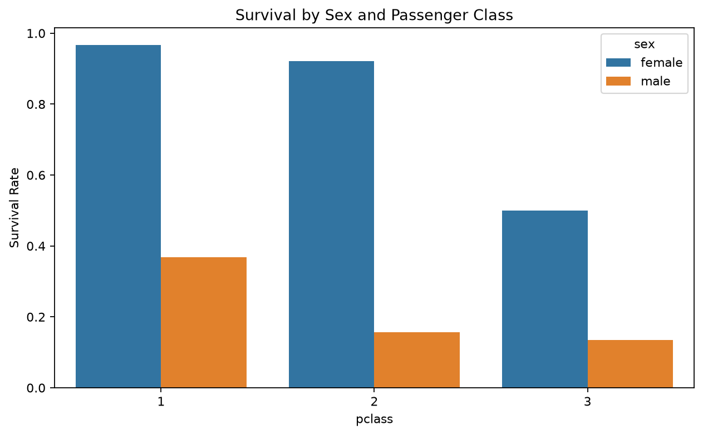
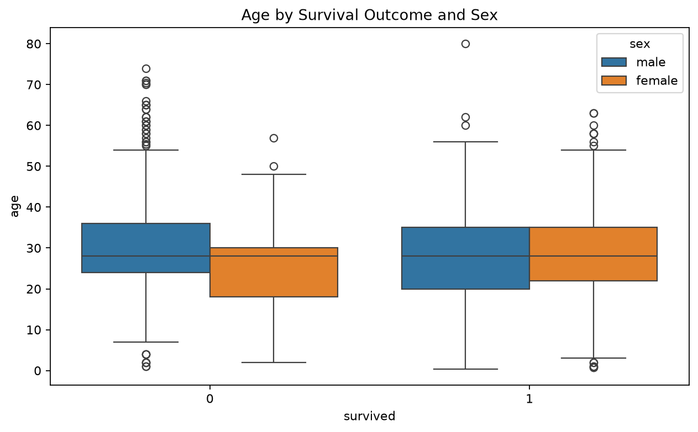
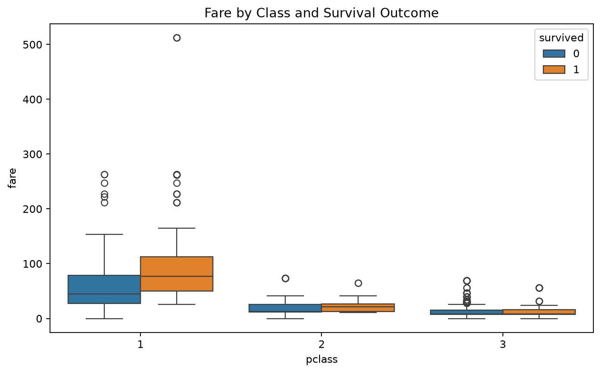
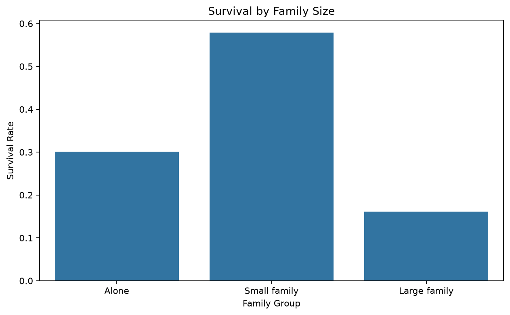

# Zepto Capstone Project

This repository contains the complete Zepto capstone project, broken down into three main modules:
1. **Data Pipeline** (\data_pipeline/\)
2. **Analytics Pipeline** (\nalytics/\)
3. **Support Assistant** (\support-assistant/\)

Each section below contains the full documentation for its respective module.

---

## Q1 Data Pipeline

This module scrapes product-style catalogue data from [Books to Scrape](https://books.toscrape.com/), cleans it, converts prices from GBP to INR, stores the data in a normalized SQLite database, and runs SQL plus pandas checks.

The required fixed conversion rate is:

```text
1 GBP = 105.50 INR
```

This is a project-defined constant, not a live or historical exchange rate.

### Files

- `scrape-clean-store-data.py`: complete pipeline script.
- `requirements.txt`: Python packages needed for this module.
- `cleaned_books.csv`: generated cleaned dataset.
- `books_catalog.db`: generated SQLite database.
- `query_outputs.md`: generated SQL outputs and pandas comparison.

### Install

From the repository root:

```bash
cd data_pipeline
python -m pip install -r requirements.txt
```

If your system has multiple Python versions, use the Python command that works on your machine, for example `py`, `python3`, or a virtual environment Python.

### Run

From the repository root:

```bash
python data_pipeline/scrape-clean-store-data.py
```

Or from inside this folder:

```bash
python scrape-clean-store-data.py
```

The script runs end to end without manual copy-pasting. It scrapes categories from the website sidebar until it has at least 3 categories and at least 60 books.

### Cleaning Decisions

The raw scraped fields are cleaned as follows:

- `price`: the `£` symbol is removed and the value is converted to `price_gbp` as a float.
- `star_rating`: words like `One`, `Two`, and `Three` are converted to integer `rating` values from 1 to 5.
- `availability`: text containing `In stock` becomes `in_stock = True`; text containing `Out of stock` becomes `False`.
- `price_inr`: calculated as `price_gbp * 105.50`.

If numeric fields fail to parse, the script uses median imputation. This keeps one messy numeric row from crashing the whole pipeline. Rows with invalid title, category, or stock status are dropped because these fields identify the product and category and should not be guessed.

### SQLite Schema

The database is normalized into two related tables:

```sql
CREATE TABLE categories (
    category_id INTEGER PRIMARY KEY,
    category_name TEXT UNIQUE NOT NULL
);

CREATE TABLE books (
    book_id INTEGER PRIMARY KEY,
    title TEXT NOT NULL,
    price_gbp REAL NOT NULL,
    price_inr REAL NOT NULL,
    rating INTEGER NOT NULL CHECK (rating BETWEEN 1 AND 5),
    in_stock INTEGER NOT NULL CHECK (in_stock IN (0, 1)),
    category_id INTEGER NOT NULL,
    FOREIGN KEY (category_id) REFERENCES categories(category_id)
);
```

`books.category_id` references `categories.category_id`, so category names are stored once and reused through the foreign key.

### SQL Query Coverage

The generated `query_outputs.md` includes five query result sections:

- Highest priced in-stock books: covers `SELECT`, `WHERE`, `ORDER BY`, `LIMIT`, and `JOIN`.
- Distinct categories: covers `DISTINCT`.
- Highly rated books: covers `IN`.
- Mid-price books: covers `BETWEEN`.
- Category summary: covers aggregation and another `JOIN`.

At least two outputs are loaded through `pd.read_sql(...)` because all five query outputs are read into pandas DataFrames using `pd.read_sql(...)`.

### pandas Merge Check

The script recreates the highest priced in-stock books join using `pd.merge(...)` on the in-memory `books_df` and `categories_df`.

It then compares the pandas result with the SQL join result. The generated output file ends with:

```text
MATCH: True
```

when both approaches produce the same table.


---

## Q2 Analytics Pipeline

This module completes the Titanic analytics and modeling task for the Zepto capstone project.

### Install

```bash
python -m pip install -r requirements.txt
```

### Run

```bash
python run_all.py
```

The raw Titanic dataset is loaded exactly once in `01_eda.py` using `sns.load_dataset('titanic')`, then immediately saved as `titanic.csv`. The modeling script reads `titanic_cleaned.csv` and does not load the raw dataset again.

### Generated Files

- `titanic.csv`: raw offline fallback.
- `titanic_cleaned.csv`: cleaned dataset used by modeling.
- `analytics/charts/`: EDA and modeling chart images.
- `best_classifier_pipeline.joblib`: saved preprocessing plus classifier pipeline.
- `eda_report.md` and `modeling_report.md`: detailed generated reports.

## Q2 Part A: EDA Report

### Dataset Profile

- Raw shape: (891, 15)
- Cleaned shape: (889, 15)

#### df.info()

```text
<class 'pandas.DataFrame'>
RangeIndex: 891 entries, 0 to 890
Data columns (total 15 columns):
 #   Column       Non-Null Count  Dtype   
---  ------       --------------  -----   
 0   survived     891 non-null    int64   
 1   pclass       891 non-null    int64   
 2   sex          891 non-null    str     
 3   age          714 non-null    float64 
 4   sibsp        891 non-null    int64   
 5   parch        891 non-null    int64   
 6   fare         891 non-null    float64 
 7   embarked     889 non-null    str     
 8   class        891 non-null    category
 9   who          891 non-null    str     
 10  adult_male   891 non-null    bool    
 11  deck         203 non-null    category
 12  embark_town  889 non-null    str     
 13  alive        891 non-null    str     
 14  alone        891 non-null    bool    
dtypes: bool(2), category(2), float64(2), int64(4), str(5)
memory usage: 80.7 KB
```

#### df.describe()

|             |   count |   unique | top         |   freq |       mean |        std |    min |      25% |      50% |   75% |     max |
|:------------|--------:|---------:|:------------|-------:|-----------:|-----------:|-------:|---------:|---------:|------:|--------:|
| survived    |     891 |      nan | nan         |    nan |   0.383838 |   0.486592 |   0    |   0      |   0      |     1 |   1     |
| pclass      |     891 |      nan | nan         |    nan |   2.30864  |   0.836071 |   1    |   2      |   3      |     3 |   3     |
| sex         |     891 |        2 | male        |    577 | nan        | nan        | nan    | nan      | nan      |   nan | nan     |
| age         |     714 |      nan | nan         |    nan |  29.6991   |  14.5265   |   0.42 |  20.125  |  28      |    38 |  80     |
| sibsp       |     891 |      nan | nan         |    nan |   0.523008 |   1.10274  |   0    |   0      |   0      |     1 |   8     |
| parch       |     891 |      nan | nan         |    nan |   0.381594 |   0.806057 |   0    |   0      |   0      |     0 |   6     |
| fare        |     891 |      nan | nan         |    nan |  32.2042   |  49.6934   |   0    |   7.9104 |  14.4542 |    31 | 512.329 |
| embarked    |     889 |        3 | S           |    644 | nan        | nan        | nan    | nan      | nan      |   nan | nan     |
| class       |     891 |        3 | Third       |    491 | nan        | nan        | nan    | nan      | nan      |   nan | nan     |
| who         |     891 |        3 | man         |    537 | nan        | nan        | nan    | nan      | nan      |   nan | nan     |
| adult_male  |     891 |        2 | True        |    537 | nan        | nan        | nan    | nan      | nan      |   nan | nan     |
| deck        |     203 |        7 | C           |     59 | nan        | nan        | nan    | nan      | nan      |   nan | nan     |
| embark_town |     889 |        3 | Southampton |    644 | nan        | nan        | nan    | nan      | nan      |   nan | nan     |
| alive       |     891 |        2 | no          |    549 | nan        | nan        | nan    | nan      | nan      |   nan | nan     |
| alone       |     891 |        2 | True        |    537 | nan        | nan        | nan    | nan      | nan      |   nan | nan     |

### Missing Values and Cleaning Decisions

|             |   missing_count |   missing_percent |
|:------------|----------------:|------------------:|
| deck        |             688 |             77.22 |
| age         |             177 |             19.87 |
| embarked    |               2 |              0.22 |
| embark_town |               2 |              0.22 |

- Dropped 2 rows for embarked, embark_town because each had under 5% missing values.
- Imputed age with median 28.0 because it had 19.87% missing values, which is in the 5%-30% rule range.
- Encoded deck missing values as 'Missing' because deck had 77.22% missing values, too high for reliable imputation.

### Univariate Analysis

| column   |   outlier_count |   lower_bound |   upper_bound |
|:---------|----------------:|--------------:|--------------:|
| age      |              65 |          2.5  |         54.5  |
| fare     |             114 |        -26.76 |         65.66 |

Fare mean = 32.10, median = 14.45, and mode = 8.05. Because the mean is greater than the median and the median is greater than or equal to the mode, fare is right-skewed; a smaller number of very expensive tickets pulls the average upward.

### Bivariate Analysis

#### Survival by Sex

| group   |   survival_rate_percent |
|:--------|------------------------:|
| female  |                   74.04 |
| male    |                   18.89 |

#### Survival by Passenger Class

| group    |   survival_rate_percent |
|:---------|------------------------:|
| pclass_1 |                   62.62 |
| pclass_2 |                   47.28 |
| pclass_3 |                   24.24 |

#### Survival by Sex and Passenger Class

| sex    |   pclass |   survival_rate_percent |
|:-------|---------:|------------------------:|
| female |        1 |                   96.74 |
| female |        2 |                   92.11 |
| female |        3 |                   50    |
| male   |        1 |                   36.89 |
| male   |        2 |                   15.74 |
| male   |        3 |                   13.54 |

### Correlation Matrix

The heatmap uses exactly survived, pclass, age, sibsp, parch, and fare. The derived boolean columns adult_male and alone are excluded.

|          |   survived |   pclass |    age |   sibsp |   parch |   fare |
|:---------|-----------:|---------:|-------:|--------:|--------:|-------:|
| survived |      1     |   -0.336 | -0.07  |  -0.034 |   0.083 |  0.255 |
| pclass   |     -0.336 |    1     | -0.337 |   0.082 |   0.017 | -0.548 |
| age      |     -0.07  |   -0.337 |  1     |  -0.233 |  -0.171 |  0.094 |
| sibsp    |     -0.034 |    0.082 | -0.233 |   1     |   0.415 |  0.161 |
| parch    |      0.083 |    0.017 | -0.171 |   0.415 |   1     |  0.218 |
| fare     |      0.255 |   -0.548 |  0.094 |   0.161 |   0.218 |  1     |

#### Two Strongest Off-Diagonal Correlations

| feature_pair   |   correlation |   absolute_correlation |
|:---------------|--------------:|-----------------------:|
| pclass vs fare |        -0.548 |                  0.548 |
| sibsp vs parch |         0.415 |                  0.415 |

The strongest pair is pclass vs fare with correlation -0.548. The second strongest pair is sibsp vs parch with correlation 0.415. These values summarize the two largest linear relationships among the selected numeric columns.

### Multivariate Data Story



Women show a much higher survival rate than men across passenger classes. First-class passengers also survive more often than lower-class passengers, suggesting that both gender and class shaped access to safety.



The age chart shows that survival patterns differ by sex across a wide age range. It also shows that age alone does not explain survival as strongly as sex and class do.



Higher fares are concentrated in first class, and first-class passengers have better survival outcomes. Fare is therefore partly a proxy for class and access to better locations or resources on the ship.



Passengers traveling in small family groups tend to do better than passengers traveling alone or in larger groups. This suggests that moderate family support may have helped, while large groups may have been harder to coordinate during evacuation.

### Exploratory Standardization Check

| column   |   before_mean |   before_std |   after_mean |   after_std |
|:---------|--------------:|-------------:|-------------:|------------:|
| age      |       29.3152 |      12.9776 |            0 |           1 |
| fare     |       32.0967 |      49.6695 |            0 |           1 |

The standardized age and fare columns have means near 0 and standard deviations near 1. This check is only for EDA; the modeling pipeline performs its own train-only scaling later.


## Q2 Part B: Modeling Report

### Class Balance and Split

|   survived |   count |   percent |
|-----------:|--------:|----------:|
|          0 |     549 |     61.75 |
|          1 |     340 |     38.25 |

A stratified train/test split is used before preprocessing so the survived/not-survived class ratio stays similar in both folds.

### Preprocessing

Numeric features are median-imputed and scaled with StandardScaler. Categorical features are most-frequent-imputed and one-hot encoded. These steps are inside scikit-learn Pipeline/ColumnTransformer objects, so they are fit only on training data and only transformed on test data.

### Classifier Comparison

| model               | confusion_matrix     |   accuracy |   precision |   recall |     f1 |    auc |
|:--------------------|:---------------------|-----------:|------------:|---------:|-------:|-------:|
| Logistic Regression | [[98, 12], [21, 47]] |     0.8146 |      0.7966 |   0.6912 | 0.7402 | 0.861  |
| Decision Tree       | [[95, 15], [24, 44]] |     0.7809 |      0.7458 |   0.6471 | 0.6929 | 0.8573 |
| Random Forest       | [[94, 16], [21, 47]] |     0.7921 |      0.746  |   0.6912 | 0.7176 | 0.8373 |

### Imbalance Handling Comparison

| variant                      |   precision |   recall |     f1 |
|:-----------------------------|------------:|---------:|-------:|
| baseline_logistic_regression |      0.7966 |   0.6912 | 0.7402 |
| class_weight_balanced        |      0.7324 |   0.7647 | 0.7482 |
| smote_training_only          |      0.7463 |   0.7353 | 0.7407 |

The best imbalance strategy by F1 was class_weight_balanced with F1 0.7482. This comparison keeps SMOTE inside the training pipeline only, so synthetic examples are never created from the test fold.

### Random Forest GridSearchCV

- Best parameters: `{'classifier__max_depth': 5, 'classifier__max_features': 'sqrt', 'classifier__n_estimators': 200}`
- OOB score from best RandomForestClassifier(oob_score=True): 0.8158

### Regression Side Task

| model             |     MAE |    RMSE |     R2 |   Adjusted_R2 |
|:------------------|--------:|--------:|-------:|--------------:|
| Linear Regression | 21.0986 | 41.7021 | 0.3482 |        0.3091 |

The residual plot suggests heteroscedasticity because residual spread changes between lower and higher predicted fares.

### Final Model Comparison Table

Classification metrics and regression metrics are shown as separate metric groups because they are on different scales.

#### Classification Metrics

| model               |   accuracy |   precision |   recall |     f1 |    auc | metric_group   |
|:--------------------|-----------:|------------:|---------:|-------:|-------:|:---------------|
| Logistic Regression |     0.8146 |      0.7966 |   0.6912 | 0.7402 | 0.861  | classification |
| Decision Tree       |     0.7809 |      0.7458 |   0.6471 | 0.6929 | 0.8573 | classification |
| Random Forest       |     0.7921 |      0.746  |   0.6912 | 0.7176 | 0.8373 | classification |

#### Regression Metrics

| model             |     MAE |    RMSE |     R2 |   Adjusted_R2 | metric_group   |
|:------------------|--------:|--------:|-------:|--------------:|:---------------|
| Linear Regression | 21.0986 | 41.7021 | 0.3482 |        0.3091 | regression     |

### Final Recommendation

I would deploy Logistic Regression because it produced the strongest F1 score (0.740) among the three baseline classifiers while also achieving accuracy 0.815, precision 0.797, recall 0.691, and AUC 0.861. F1 is a good primary metric here because the survived and not-survived classes are not perfectly balanced. The saved joblib artifact contains preprocessing plus the classifier, so it can predict from raw feature rows.

### Saved Pipeline Reload Check

- Saved artifact: `best_classifier_pipeline.joblib`
- Reloaded pipeline predictions on five raw rows: [0, 0, 0, 0, 0]


---

## Q3 Zepto Support Assistant

A Retrieval-Augmented Generation (RAG) pipeline that answers Zepto customer-support queries using local policy documents, ChromaDB vector search, a LangGraph workflow, and a FastAPI endpoint.

---

### Architecture Flow

```
+---------------------------------------------------------------------+
|                        OFFLINE  (run once)                          |
|                                                                     |
|   docs/doc_01.txt ... doc_08.txt                                    |
|           |                                                         |
|           v                                                         |
|   1. INGESTION  --  load_documents()                                |
|           |         Reads all 8 policy .txt files from docs/        |
|           v                                                         |
|   2. EMBEDDING  --  embed_texts()                                   |
|           |         sentence-transformers/all-MiniLM-L6-v2          |
|           |         produces normalised 384-dim float vectors        |
|           v                                                         |
|      ChromaDB  (chroma_store/, cosine similarity)                   |
|           |         Persists ids, documents, metadata, embeddings   |
+-----------|-------------------------------------------------------------+
            |
+-----------|----------------------------------------------------- ONLINE -+
|           v                                                         |
|   POST /ask  { "query": "..." }                                     |
|           |                                                         |
|           v                                                         |
|   LangGraph  -- classify_intent node                                |
|           |     keyword heuristic (or optional Groq LLM)            |
|           |                                                         |
|      +----+------------------------------+                          |
|      | policy_question                   | general_question         |
|      v                                   v                          |
|  3. RETRIEVAL                     direct_answer node                |
|     query_collection()            Returns canned / LLM reply        |
|     top-3 cosine matches                                            |
|      |                                                              |
|      v                                                              |
|  4. GENERATION                                                      |
|     Mock mode  -> deterministic snippet from top chunk              |
|     Real mode  -> Groq LLM call with structured JSON prompt         |
|      |           (up to 3 retries with Pydantic validation)         |
|      v                                                              |
|   AskResponse { answer, sources, confidence }                       |
+---------------------------------------------------------------------+
```

#### Stage Details

| Stage | File | Key Function |
|---|---|---|
| **Ingestion** | `ingest.py` | `load_documents()` — reads & validates exactly 8 docs |
| **Embedding** | `ingest.py` | `embed_texts()` — MiniLM model, L2-normalised |
| **Storage** | `ingest.py` | `get_chroma_collection()` — persistent cosine-space collection |
| **Routing** | `rag_graph.py` | `classify_intent` node — keyword or Groq LLM |
| **Retrieval** | `ingest.py` | `query_collection()` — top-3 nearest neighbours |
| **Generation** | `rag_graph.py` | `retrieve_and_answer` / `direct_answer` nodes |
| **Schema** | `schemas.py` | `AskResponse` — Pydantic model with JSON validation |
| **API** | `main.py` | FastAPI `POST /ask` endpoint |

---

### Project Structure

```
support-assistant/
+-- docs/                    # 8 Zepto policy documents (source corpus)
|   +-- doc_01.txt           # Delivery policy
|   +-- doc_02.txt           # Return policy
|   +-- doc_03.txt           # Refund policy
|   +-- doc_04.txt           # Membership / Zepto Pass
|   +-- doc_05.txt           # Order tracking
|   +-- doc_06.txt           # Cancellation policy
|   +-- doc_07.txt           # Gift cards
|   +-- doc_08.txt           # Customer support hours
+-- chroma_store/            # Auto-created -- ChromaDB persistence directory
+-- ingest.py                # Ingestion, embedding, and retrieval helpers
+-- rag_graph.py             # LangGraph workflow (classify -> retrieve -> generate)
+-- prompt_template.py       # Structured few-shot prompt for real-LLM mode
+-- schemas.py               # Pydantic request / response models
+-- main.py                  # FastAPI application
+-- demo_requests.py         # Quick smoke-test: one policy + one general query
+-- Dockerfile               # Container definition
+-- requirements.txt         # Python dependencies
```

---

### Quick Start

#### 1 — Install dependencies

```bash
pip install -r requirements.txt
```

#### 2 — Build the vector index (one-time)

```bash
python ingest.py
## Embedded and stored 8 Zepto policy chunks in ChromaDB.
```

> The index is rebuilt automatically on first API startup if `chroma_store/` is missing or incomplete.

#### 3 — Start the API

```bash
uvicorn main:app --reload
## Uvicorn running on http://127.0.0.1:8000
```

#### 4 — Send a query

**Policy query** (triggers retrieval path):

```bash
curl -s -X POST http://localhost:8000/ask \
  -H "Content-Type: application/json" \
  -d '{"query": "What is Zepto delivery fee for small orders?"}'
```

Expected response shape:

```json
{
  "answer": "Based on the retrieved context: ...",
  "sources": ["doc_01", "doc_05", "doc_03"],
  "confidence": 1.0
}
```

**General / unrelated query** (skips retrieval):

```bash
curl -s -X POST http://localhost:8000/ask \
  -H "Content-Type: application/json" \
  -d '{"query": "Who won the football match yesterday?"}'
```

```json
{
  "answer": "I can only answer questions about Zepto policies right now.",
  "sources": [],
  "confidence": 1.0
}
```

---

### Query Routing

Routing is performed by the `classify_intent` LangGraph node.

| Condition | Intent | Next Node |
|---|---|---|
| Query contains a policy keyword | `policy_question` | `retrieve_and_answer` |
| Query contains no policy keyword | `general_question` | `direct_answer` |

**Policy keywords:** `delivery`, `return`, `refund`, `membership`, `tracking`, `cancel`, `gift card`, `support hours`

---

### Response Schema

Every response is validated against `AskResponse` (Pydantic):

```json
{
  "answer":     "assistant answer string (up to 120 words in real-LLM mode)",
  "sources":    ["doc_01", "doc_02"],
  "confidence": 0.95
}
```

| Field | Type | Constraint |
|---|---|---|
| `answer` | `str` | Required, non-empty |
| `sources` | `list[str]` | Chunk/document IDs; empty for general queries |
| `confidence` | `float` | `0.0 to 1.0` inclusive |

---

### Mock vs Real-LLM Mode

| Mode | `MOCK_LLM` env var | Behaviour |
|---|---|---|
| **Mock** (default) | `1` or unset | Deterministic answers; no external API calls |
| **Real LLM** | `0` | Calls Groq API; requires `GROQ_API_KEY` |

To enable real-LLM mode:

```bash
export MOCK_LLM=0
export GROQ_API_KEY=gsk_...
export GROQ_MODEL=llama-3.1-8b-instant   # optional, this is the default
uvicorn main:app --reload
```

---

### Running Demo Requests

```bash
python demo_requests.py
```

Fires one policy query and one general query against an in-process `TestClient` and prints the raw JSON responses.

---

### Docker

```bash
docker build -t zepto-support-assistant .
docker run -p 8000:8000 zepto-support-assistant
```

---

### Dependencies

| Package | Purpose |
|---|---|
| `fastapi` | HTTP API framework |
| `uvicorn` | ASGI server |
| `langgraph` | Stateful graph orchestration |
| `chromadb` | Local vector database |
| `sentence-transformers` | Local embedding model (MiniLM-L6-v2) |
| `pydantic` | Request/response validation |
| `requests` | Optional Groq API calls |
